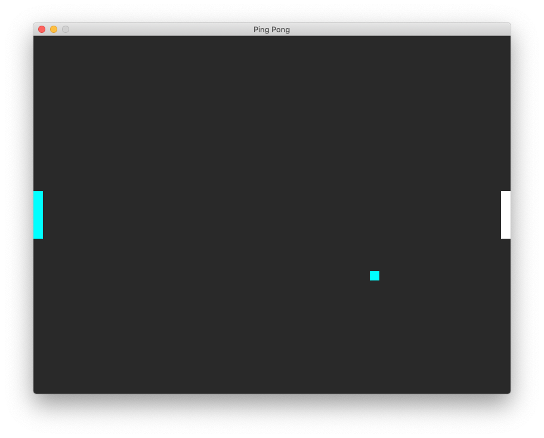

# C-SDL2-Pong-Game

Small Ping Pong Game that I made to teach my little brother learn C++ and Game Development.
About basic stuffs like: 
* Update loop
* Render
* Collision
* ...

This is using SDL2, I recommend you to use something else for 2D C++ game development like Cocos2dx

